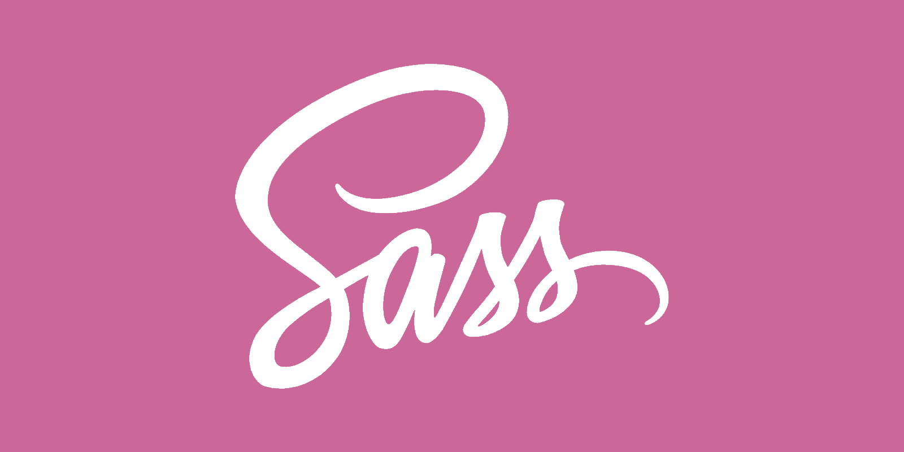

<div align="center">
  <br />
  
  <br />
  <br />
  <h1>:art: Sass(SCSS) 가이드 (Sass(SCSS) Guide)</h1>
</div>
 
<br />
 
## 목차
 
1. **[개요](#개요)**
2. **[주석](#주석)**

<br />

## 개요

**Sass(SCSS)** 는 CSS의 불폄함을 해결해주는 `CSS 전처리기(Preprocessor)`이다.  
표준 CSS 보다 훨씬 많은 기능`(선택자의 중첩, 조건문, 반복문, 다양한 단위의 연산 등)`을 사용하여 더 편리하게 작성할 수 있다.

<br />

<div>
  <div>
    
    
  </div>
  <div>
    <br />
    
    <span>
      <strong>컴파일(Compile)</strong>
    </span>
    <br />
    <br />
  </div>
  <div>
    
    
  </div>
<div>

> 프로젝트에서 Sass 문법을 사용해 코딩을 진행하게 되면 **컴파일(Compile)** 을 통해 표준 CSS로 변환하여 사용자 브라우저에서 동작할 수 있게 한다.

<br />

### Sass와 SCSS의 차이점은?

**SCSS**는 Sass(Syntactically Awesome Style Sheets)의 3버전에서 새롭게 등장하였다.  
**SCSS**는 CSS 구문과 완전히 호환되도록 하여 `CSS와 거의 같은 문법으로 Sass 기능을 지원`한다.

|        구분        |   Sass   |     SCSS     |
| :----------------: | :------: | :----------: |
|  선택자 유효범위   | 들여쓰기 | `{}`(중괄호) |
| `;`(새미콜론) 유무 |    O     |      X       |

- **Sass**

```sass
.container
  width: 100px
  height: 100px
  h1
    color: blue
    font-size: 12px
```

- **SCSS**

```scss
.container {
  width: 100px;
  height: 100px;
  h1 {
    color: blue;
    font-size: 12px;
  }
}
```

<br />

## 주석

**SCSS**에서는 두 가지 주석 처리 방법이 있다.

첫 번째, 표준 CSS 주석 처리 형식 `/* comment */`  
두 번째, SCSS에서의 주석 처리 형식 `// comment`

> 표준 CSS 주석 처리 형식인 `/* comment */` 사용 시 SCSS에서 CSS로 컴파일된 후에도 주석 라인이 유지된다. 하지만 SCSS 주석 처리 형식인 `// comment`을 사용하면 컴파일 후 주석 라인이 사라진다.

- **SCSS**

```scss
.container {
  h1 {
    background-color: yellow;
    /* color: blue; */
    // font-size: 12px;
  }
}
```

- **CSS**

```css
.container h1 {
  background-color: yellow;
  /* color: blue; */
}
```
